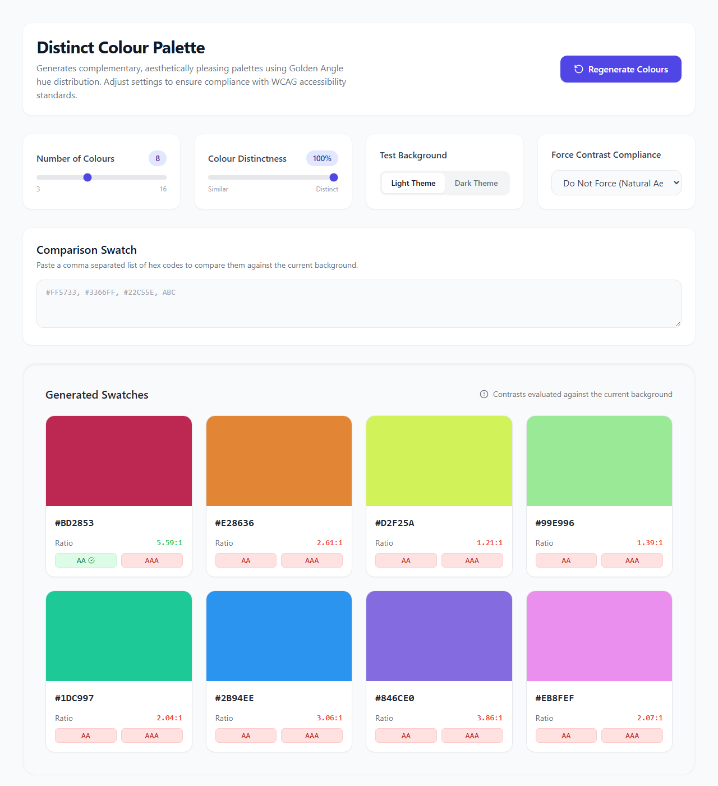

# Accessible Palettes — WCAG Colour Palette Generator

Generates sets of 3–16 visually distinct colour swatches and checks their contrast against a background, so a designer or developer picking UI colours can see at a glance which ones meet WCAG contrast requirements.



**Live tool:** https://hazzjc.github.io/AccessiblePalettesWCAGColourPaletteGenerator/

> The README previously pointed at `https://hazzjc.github.io/AACompliantColourPalette/`, an old repository name. That path no longer resolves. The corrected URL above was verified against the repository's actual GitHub Pages configuration (`gh api repos/HazzJC/AccessiblePalettesWCAGColourPaletteGenerator/pages` → `status: "built"`, source `main` / `/`) and by loading it in a browser.

## What it does

- **Generates a palette.** Steps through hue values across a configurable spread (the "Colour Distinctness" slider) using a fixed cycle of saturation/lightness offsets, so swatches look varied rather than identical shades of one hue.
- **Checks contrast against one background colour.** Every swatch, and any hex codes you paste into the "Comparison Swatch" box, is scored against the currently selected test background (a fixed light `#F9FAFB` or dark `#111827`), showing the numeric contrast ratio plus pass/fail badges for **AA** and **AAA**.
- **Can force compliance.** The "Force Contrast Compliance" selector will walk a swatch's HSL lightness up or down (in whole-percent steps) until it clears the chosen target ratio, or until lightness bottoms/tops out at 0/100 if the target is unreachable for that hue/saturation.
- **Accepts pasted hex codes**, including 3-digit shorthand (e.g. `ABC` → `#AABBCC`), for comparing existing brand colours instead of only generated ones.

This is a single self-contained `index.html` file (React + Babel + Tailwind, all loaded from CDNs) — there is no build step and no server-side code.

## How the contrast logic works

The relevant code lives entirely in `index.html`. It implements the standard WCAG 2.x contrast algorithm:

1. **Relative luminance** (`getLuminance`, `index.html`): each sRGB channel is linearised (`v ≤ 0.03928 ? v/12.92 : ((v+0.055)/1.055)^2.4`) and combined as `0.2126·R + 0.7152·G + 0.0722·B` — this matches the WCAG definition of relative luminance.
2. **Contrast ratio** (`getContrastRatio`): `(L_lighter + 0.05) / (L_darker + 0.05)`, the standard WCAG contrast-ratio formula, computed between a swatch and the single selected test background.
3. **Thresholds applied** (`buildColorMeta` / palette generation): a swatch is flagged
   - `isAA` when ratio ≥ **4.5:1** (WCAG AA, normal text)
   - `isAAA` when ratio ≥ **7.0:1** (WCAG AAA, normal text)

   Both figures match the official thresholds, and the tool **does correctly evaluate both AA and AAA**, not just AA — despite the repository's original name and README implying AA-only support.

### What the badges do *not* tell you

- **Large-text thresholds are computed but hidden.** The code also computes `isLargeAA` at ratio ≥ 3.1:1, but this value is never rendered in the UI — only the normal-text AA/AAA badges are shown. So every badge you see assumes normal-size text (WCAG's large-text thresholds are 3:1 for AA and 4.5:1 for AAA). If you're styling large text (≥18pt, or ≥14pt bold), the visible badges will be stricter than necessary — check the numeric ratio yourself against 3:1 / 4.5:1.
- **The internal large-text constant is 3.1:1, not the spec's 3.0:1.** This is a minor, conservative deviation (it would occasionally mark a swatch that just barely passes large-text AA as not passing), not an overclaim — but it's not exactly to spec either.

## Limitations (read before relying on this for compliance sign-off)

- **Only one background at a time is checked.** Contrast is evaluated against a single selected test background (`#F9FAFB` light or `#111827` dark), not against arbitrary/custom backgrounds, and not between the generated swatches themselves (e.g. swatch 3 vs swatch 5). "Distinct" palettes are separated by hue spacing only — two adjacent swatches can still have poor contrast against each other even though each passes against the background.
- **No colour-blindness simulation.** The tool does not simulate protanopia, deuteranopia, tritanopia, or any other form of colour vision deficiency, and does not warn when two swatches would be hard to distinguish under one.
- **sRGB / hex only.** Input and output are limited to 6-digit (or 3-digit shorthand) hex codes, i.e. standard sRGB. There is no support for P3, Lab, HSL string input, named CSS colours, or other colour spaces/formats.
- **Normal-text thresholds only are surfaced in the UI**, as noted above — large-text AA/AAA is computed but not shown.
- **"Force Compliance" only adjusts lightness**, in whole-integer HSL steps, and only for the currently selected background. It does not adjust hue or saturation, and if no lightness value in range achieves the target ratio it silently settles for the closest boundary (0% or 100% lightness) rather than reporting failure.
- **No persistence, export, or WCAG-report output.** Copying a hex code to the clipboard is the only "export" feature — there's no saved palette, JSON/CSS export, or shareable link.

## Quality evidence

There is no automated test suite in this repository (no test framework, no CI config) — everything above was verified manually:

- Contrast formula and thresholds verified by reading `index.html` line-by-line against the WCAG 2.x relative-luminance and contrast-ratio definitions.
- The live tool was loaded in a browser and exercised directly: generated an 8-swatch palette, pasted comparison hex codes (`#101010`, `#EFEFEF`), and confirmed the on-screen ratios and AA/AAA badges match hand-calculation (e.g. `#101010` on `#F9FAFB` correctly showed `18.21:1` and passed both AA and AAA; `#EFEFEF` on the same background correctly showed `1.10:1` and failed both).
- GitHub Pages configuration was checked via the GitHub API to confirm the live URL actually serves the current `main` branch.

If you want to verify further, load the deployed page yourself and compare its ratios against an independent WCAG contrast checker.

## Setup / running locally

No build tooling is required:

```bash
git clone https://github.com/HazzJC/AccessiblePalettesWCAGColourPaletteGenerator.git
cd AccessiblePalettesWCAGColourPaletteGenerator
# open index.html directly in a browser, or serve it locally:
python -m http.server 8000
# then visit http://localhost:8000
```

There is no test command to run — see "Quality evidence" above for how the app was actually verified.

## Licence

No licence file is present in this repository. Until one is added, all rights are reserved by default and the code should not be assumed to be reusable.
